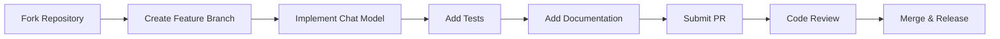

# 🚀 Contributing Your Custom LLM to LangChain & Creating Your Own Package

This comprehensive guide explains how to contribute your Nugen.in LLM to the official LangChain repository and create your own distributable package.

## 📋 Table of Contents

1. [LangChain Contribution Flow](#langchain-contribution-flow)
2. [Creating Your Own Package](#creating-your-own-package)
3. [Package Structure](#package-structure)
4. [Implementation Requirements](#implementation-requirements)
5. [Testing & Documentation](#testing--documentation)
6. [Publishing Process](#publishing-process)

## 🔄 LangChain Contribution Flow

### **Step 1: Understanding LangChain's Architecture**

LangChain organizes integrations into separate packages:
```
langchain-core          # Core abstractions
langchain-community     # Community integrations  
langchain-{provider}    # Official provider packages (e.g., langchain-openai)
```

### **Step 2: Choose Your Contribution Path**

#### **Option A: Official LangChain Integration**
- **Target:** `langchain-community` repository
- **Benefits:** Official support, included in docs
- **Requirements:** Higher code quality standards, full test coverage

#### **Option B: Your Own Package**
- **Target:** Independent package (`langchain-nugen`)
- **Benefits:** Full control, faster development
- **Requirements:** Your own maintenance and support

### **Step 3: LangChain Contribution Process**



#### **Detailed Steps:**

1. **Fork the Repository**
   ```bash
   git clone https://github.com/langchain-ai/langchain.git
   cd langchain
   git checkout -b feature/nugen-integration
   ```

2. **Navigate to Community Package**
   ```bash
   cd libs/community/
   ```

3. **Create Your Integration**
   ```bash
   mkdir -p langchain_community/chat_models/nugen/
   touch langchain_community/chat_models/nugen/__init__.py
   touch langchain_community/chat_models/nugen/nugen.py
   ```

## 🏗️ Creating Your Own Package

### **Step 1: Package Structure**

Create a complete package structure:

```
langchain-nugen/
├── langchain_nugen/
│   ├── __init__.py
│   ├── chat_models/
│   │   ├── __init__.py
│   │   └── nugen.py
│   └── llms/
│       ├── __init__.py
│       └── nugen.py
├── tests/
│   ├── __init__.py
│   ├── integration_tests/
│   │   └── test_nugen_integration.py
│   └── unit_tests/
│       └── test_nugen_unit.py
├── docs/
│   └── nugen.md
├── examples/
│   └── nugen_examples.ipynb
├── setup.py
├── pyproject.toml
├── README.md
├── LICENSE
└── CHANGELOG.md
```

### **Step 2: Implement BaseChatModel (Preferred)**

Following LangChain's latest standards, implement `BaseChatModel`:

```python
# langchain_nugen/chat_models/nugen.py
from typing import Any, Dict, Iterator, List, Optional, Union, AsyncIterator
import requests
import json
from langchain_core.callbacks.manager import (
    AsyncCallbackManagerForLLMRun,
    CallbackManagerForLLMRun,
)
from langchain_core.language_models.chat_models import BaseChatModel
from langchain_core.messages import (
    AIMessage,
    BaseMessage,
    HumanMessage,
    SystemMessage,
)
from langchain_core.outputs import ChatGeneration, ChatResult
from langchain_core.pydantic_v1 import Field, SecretStr, root_validator
from langchain_core.utils import get_from_dict_or_env


class ChatNugen(BaseChatModel):
    """Nugen.in Chat Model Integration.
    
    Example:
        .. code-block:: python
        
            from langchain_nugen import ChatNugen
            
            chat = ChatNugen(
                api_key="your-api-key",
                model_name="nugen-flash-instruct"
            )
            
            messages = [HumanMessage(content="Hello, how are you?")]
            response = chat(messages)
    """
    
    # Required fields
    api_key: SecretStr = Field(description="Nugen.in API Key")
    model_name: str = Field(default="nugen-flash-instruct", description="Model name")
    base_url: str = Field(default="https://api.nugen.in", description="API base URL")
    
    # Optional parameters
    temperature: float = Field(default=0.7, ge=0.0, le=2.0)
    max_tokens: int = Field(default=1000, gt=0)
    top_p: float = Field(default=1.0, ge=0.0, le=1.0)
    
    # Internal fields
    _client: Any = None
    
    class Config:
        """Configuration for this pydantic object."""
        extra = "forbid"
        arbitrary_types_allowed = True
        
    @root_validator()
    def validate_environment(cls, values: Dict) -> Dict:
        """Validate environment variables and configuration."""
        api_key = get_from_dict_or_env(
            values, "api_key", "NUGEN_API_KEY"
        )
        values["api_key"] = SecretStr(api_key) if isinstance(api_key, str) else api_key
        return values
    
    @property
    def _llm_type(self) -> str:
        """Return type of chat model."""
        return "nugen-chat"
    
    @property
    def _identifying_params(self) -> Dict[str, Any]:
        """Get identifying parameters."""
        return {
            "model_name": self.model_name,
            "temperature": self.temperature,
            "max_tokens": self.max_tokens,
            "top_p": self.top_p,
        }
    
    def _convert_messages_to_prompt(self, messages: List[BaseMessage]) -> str:
        """Convert LangChain messages to Nugen.in format."""
        prompt_parts = []
        
        for message in messages:
            if isinstance(message, SystemMessage):
                prompt_parts.append(f"System: {message.content}")
            elif isinstance(message, HumanMessage):
                prompt_parts.append(f"Human: {message.content}")
            elif isinstance(message, AIMessage):
                prompt_parts.append(f"Assistant: {message.content}")
            else:
                prompt_parts.append(f"Unknown: {message.content}")
        
        return "\n".join(prompt_parts) + "\nAssistant:"
    
    def _generate(
        self,
        messages: List[BaseMessage],
        stop: Optional[List[str]] = None,
        run_manager: Optional[CallbackManagerForLLMRun] = None,
        **kwargs: Any,
    ) -> ChatResult:
        """Generate chat response."""
        prompt = self._convert_messages_to_prompt(messages)
        
        headers = {
            "Authorization": f"Bearer {self.api_key.get_secret_value()}",
            "Content-Type": "application/json"
        }
        
        payload = {
            "model": self.model_name,
            "prompt": prompt,
            "temperature": self.temperature,
            "max_tokens": self.max_tokens,
            "top_p": self.top_p,
        }
        
        if stop:
            payload["stop"] = stop
        
        try:
            response = requests.post(
                f"{self.base_url}/api/v3/inference/completions",
                headers=headers,
                json=payload,
                timeout=60
            )
            response.raise_for_status()
            result = response.json()
            
            # Extract response text
            if "choices" in result and len(result["choices"]) > 0:
                text = result["choices"][0].get("text", "")
            else:
                text = str(result)
            
            # Create AIMessage response
            message = AIMessage(content=text)
            generation = ChatGeneration(message=message)
            
            # Add usage metadata if available
            usage = result.get("usage", {})
            llm_output = {"token_usage": usage, "model_name": self.model_name}
            
            return ChatResult(generations=[generation], llm_output=llm_output)
            
        except Exception as e:
            raise Exception(f"Nugen API error: {str(e)}")
    
    def _stream(
        self,
        messages: List[BaseMessage],
        stop: Optional[List[str]] = None,
        run_manager: Optional[CallbackManagerForLLMRun] = None,
        **kwargs: Any,
    ) -> Iterator[ChatGenerationChunk]:
        """Stream chat response."""
        prompt = self._convert_messages_to_prompt(messages)
        
        headers = {
            "Authorization": f"Bearer {self.api_key.get_secret_value()}",
            "Content-Type": "application/json"
        }
        
        payload = {
            "model": self.model_name,
            "prompt": prompt,
            "temperature": self.temperature,
            "max_tokens": self.max_tokens,
            "stream": True,
        }
        
        if stop:
            payload["stop"] = stop
        
        try:
            response = requests.post(
                f"{self.base_url}/api/v3/inference/completions",
                headers=headers,
                json=payload,
                stream=True,
                timeout=60
            )
            response.raise_for_status()
            
            for line in response.iter_lines():
                if line:
                    line = line.decode('utf-8')
                    if line.startswith('data: '):
                        data = line[6:]
                        if data == '[DONE]':
                            break
                        try:
                            chunk_data = json.loads(data)
                            if "choices" in chunk_data and len(chunk_data["choices"]) > 0:
                                text = chunk_data["choices"][0].get("text", "")
                                if text:
                                    chunk = ChatGenerationChunk(
                                        message=AIMessageChunk(content=text)
                                    )
                                    if run_manager:
                                        run_manager.on_llm_new_token(text, chunk=chunk)
                                    yield chunk
                        except json.JSONDecodeError:
                            continue
                            
        except Exception as e:
            raise Exception(f"Nugen API streaming error: {str(e)}")
    
    async def _agenerate(
        self,
        messages: List[BaseMessage],
        stop: Optional[List[str]] = None,
        run_manager: Optional[AsyncCallbackManagerForLLMRun] = None,
        **kwargs: Any,
    ) -> ChatResult:
        """Async generate chat response."""
        # Implement async version using aiohttp
        # For now, fallback to sync version
        return self._generate(messages, stop, run_manager, **kwargs)
```

### **Step 3: Package Configuration Files**

#### **pyproject.toml**
```toml
[build-system]
requires = ["poetry-core>=1.0.0"]
build-backend = "poetry.core.masonry.api"

[tool.poetry]
name = "langchain-nugen"
version = "0.1.0"
description = "LangChain integration for Nugen.in LLMs"
authors = ["Your Name <your.email@example.com>"]
readme = "README.md"
repository = "https://github.com/yourusername/langchain-nugen"
documentation = "https://github.com/yourusername/langchain-nugen/blob/main/README.md"
keywords = ["langchain", "llm", "ai", "nugen"]
classifiers = [
    "Development Status :: 4 - Beta",
    "Intended Audience :: Developers",
    "License :: OSI Approved :: MIT License",
    "Programming Language :: Python :: 3",
    "Programming Language :: Python :: 3.8",
    "Programming Language :: Python :: 3.9",
    "Programming Language :: Python :: 3.10",
    "Programming Language :: Python :: 3.11",
]
packages = [{include = "langchain_nugen"}]

[tool.poetry.dependencies]
python = "^3.8.1"
langchain-core = "^0.1.0"
requests = "^2.28.0"
pydantic = "^1.10.0"

[tool.poetry.group.dev.dependencies]
pytest = "^7.0.0"
pytest-asyncio = "^0.21.0"
pytest-mock = "^3.10.0"
black = "^23.0.0"
isort = "^5.12.0"
mypy = "^1.0.0"
langchain-community = "^0.0.1"

[tool.poetry.group.docs]
optional = true

[tool.poetry.group.docs.dependencies]
sphinx = "^4.5.0"
sphinx-rtd-theme = "^1.0.0"

[tool.black]
line-length = 88
target-version = ['py38']

[tool.isort]
profile = "black"
multi_line_output = 3

[tool.mypy]
python_version = "3.8"
warn_return_any = true
warn_unused_configs = true
disallow_untyped_defs = true
```

#### **setup.py** (Alternative to poetry)
```python
from setuptools import setup, find_packages

with open("README.md", "r", encoding="utf-8") as fh:
    long_description = fh.read()

with open("requirements.txt", "r", encoding="utf-8") as fh:
    requirements = [line.strip() for line in fh if line.strip() and not line.startswith("#")]

setup(
    name="langchain-nugen",
    version="0.1.0",
    author="Your Name",
    author_email="your.email@example.com",
    description="LangChain integration for Nugen.in LLMs",
    long_description=long_description,
    long_description_content_type="text/markdown",
    url="https://github.com/yourusername/langchain-nugen",
    packages=find_packages(),
    classifiers=[
        "Development Status :: 4 - Beta",
        "Intended Audience :: Developers",
        "License :: OSI Approved :: MIT License",
        "Operating System :: OS Independent",
        "Programming Language :: Python :: 3",
        "Programming Language :: Python :: 3.8",
        "Programming Language :: Python :: 3.9",
        "Programming Language :: Python :: 3.10",
        "Programming Language :: Python :: 3.11",
    ],
    python_requires=">=3.8",
    install_requires=requirements,
    extras_require={
        "dev": [
            "pytest>=7.0.0",
            "pytest-asyncio>=0.21.0",
            "black>=23.0.0",
            "isort>=5.12.0",
            "mypy>=1.0.0",
        ],
        "docs": [
            "sphinx>=4.5.0",
            "sphinx-rtd-theme>=1.0.0",
        ],
    },
    keywords="langchain llm ai nugen chatbot",
    project_urls={
        "Bug Reports": "https://github.com/yourusername/langchain-nugen/issues",
        "Source": "https://github.com/yourusername/langchain-nugen",
        "Documentation": "https://github.com/yourusername/langchain-nugen/blob/main/README.md",
    },
)
```

### **Step 4: Package Initialization**

#### **langchain_nugen/__init__.py**
```python
"""LangChain integration for Nugen.in LLMs."""

from langchain_nugen.chat_models.nugen import ChatNugen
from langchain_nugen.llms.nugen import NugenLLM

__version__ = "0.1.0"
__all__ = ["ChatNugen", "NugenLLM"]
```

#### **langchain_nugen/chat_models/__init__.py**
```python
"""Chat models for Nugen.in."""

from langchain_nugen.chat_models.nugen import ChatNugen

__all__ = ["ChatNugen"]
```

## 🧪 Testing & Documentation

### **Step 1: Unit Tests**

#### **tests/unit_tests/test_nugen_unit.py**
```python
import pytest
from unittest.mock import Mock, patch
from langchain_core.messages import HumanMessage, AIMessage
from langchain_nugen.chat_models.nugen import ChatNugen

def test_nugen_initialization():
    """Test ChatNugen initialization."""
    chat = ChatNugen(api_key="test-key", model_name="test-model")
    assert chat._llm_type == "nugen-chat"
    assert chat.model_name == "test-model"

@patch('requests.post')
def test_nugen_generate(mock_post):
    """Test ChatNugen generation."""
    # Mock API response
    mock_response = Mock()
    mock_response.json.return_value = {
        "choices": [{"text": "Hello! How can I help you?"}],
        "usage": {"total_tokens": 10}
    }
    mock_response.raise_for_status.return_value = None
    mock_post.return_value = mock_response
    
    # Test generation
    chat = ChatNugen(api_key="test-key")
    messages = [HumanMessage(content="Hello")]
    result = chat._generate(messages)
    
    assert len(result.generations) == 1
    assert isinstance(result.generations[0].message, AIMessage)
    assert "Hello!" in result.generations[0].message.content

def test_convert_messages_to_prompt():
    """Test message conversion."""
    chat = ChatNugen(api_key="test-key")
    messages = [
        HumanMessage(content="Hello"),
        AIMessage(content="Hi there!"),
        HumanMessage(content="How are you?")
    ]
    
    prompt = chat._convert_messages_to_prompt(messages)
    expected = "Human: Hello\nAssistant: Hi there!\nHuman: How are you?\nAssistant:"
    assert prompt == expected
```

### **Step 2: Integration Tests**

#### **tests/integration_tests/test_nugen_integration.py**
```python
import os
import pytest
from langchain_core.messages import HumanMessage
from langchain_nugen.chat_models.nugen import ChatNugen

@pytest.mark.skipif(
    not os.environ.get("NUGEN_API_KEY"),
    reason="NUGEN_API_KEY not set"
)
def test_nugen_integration():
    """Test actual API integration."""
    chat = ChatNugen()  # Will use NUGEN_API_KEY from environment
    messages = [HumanMessage(content="Hello, how are you?")]
    
    result = chat._generate(messages)
    assert len(result.generations) == 1
    assert len(result.generations[0].message.content) > 0

@pytest.mark.skipif(
    not os.environ.get("NUGEN_API_KEY"),
    reason="NUGEN_API_KEY not set"
)
def test_nugen_streaming():
    """Test streaming functionality."""
    chat = ChatNugen()
    messages = [HumanMessage(content="Count to 5")]
    
    chunks = list(chat._stream(messages))
    assert len(chunks) > 0
    
    # Combine all chunks
    full_response = "".join(chunk.message.content for chunk in chunks)
    assert len(full_response) > 0
```

### **Step 3: Documentation**

#### **docs/nugen.md**
```markdown
# Nugen.in Integration

This document describes how to use the Nugen.in integration with LangChain.

## Installation

```bash
pip install langchain-nugen
```

## Usage

### Basic Usage

```python
from langchain_nugen import ChatNugen
from langchain_core.messages import HumanMessage

chat = ChatNugen(api_key="your-api-key")
messages = [HumanMessage(content="Hello!")]
response = chat(messages)
print(response.content)
```

### With Environment Variables

```python
import os
os.environ["NUGEN_API_KEY"] = "your-api-key"

chat = ChatNugen()  # Will automatically use NUGEN_API_KEY
```

### Streaming

```python
for chunk in chat.stream([HumanMessage(content="Tell me a story")]):
    print(chunk.content, end="", flush=True)
```

## Configuration

- `api_key`: Your Nugen.in API key
- `model_name`: Model to use (default: "nugen-flash-instruct")
- `temperature`: Creativity parameter (0.0-2.0, default: 0.7)
- `max_tokens`: Maximum response length (default: 1000)
```

## 📦 Publishing Process

### **Step 1: Local Development**

```bash
# Create virtual environment
python -m venv venv
source venv/bin/activate  # On Windows: venv\Scripts\activate

# Install in development mode
pip install -e .

# Run tests
pytest tests/

# Format code
black langchain_nugen/
isort langchain_nugen/

# Type checking
mypy langchain_nugen/
```

### **Step 2: Build Package**

```bash
# Using poetry
poetry build

# Or using setuptools
python setup.py sdist bdist_wheel
```

### **Step 3: Publish to PyPI**

#### **Test PyPI First**
```bash
# Upload to test PyPI
poetry publish --repository testpypi

# Or using twine
twine upload --repository testpypi dist/*

# Test installation
pip install --index-url https://test.pypi.org/simple/ langchain-nugen
```

#### **Production PyPI**
```bash
# Upload to production PyPI
poetry publish

# Or using twine
twine upload dist/*
```

### **Step 4: GitHub Actions CI/CD**

#### **.github/workflows/test.yml**
```yaml
name: Test

on:
  push:
    branches: [ main ]
  pull_request:
    branches: [ main ]

jobs:
  test:
    runs-on: ubuntu-latest
    strategy:
      matrix:
        python-version: [3.8, 3.9, "3.10", "3.11"]

    steps:
    - uses: actions/checkout@v3
    
    - name: Set up Python ${{ matrix.python-version }}
      uses: actions/setup-python@v4
      with:
        python-version: ${{ matrix.python-version }}
    
    - name: Install dependencies
      run: |
        python -m pip install --upgrade pip
        pip install -e .[dev]
    
    - name: Run tests
      run: |
        pytest tests/unit_tests/
    
    - name: Run integration tests
      env:
        NUGEN_API_KEY: ${{ secrets.NUGEN_API_KEY }}
      run: |
        pytest tests/integration_tests/
    
    - name: Lint with black
      run: |
        black --check langchain_nugen/
    
    - name: Type check with mypy
      run: |
        mypy langchain_nugen/
```

#### **.github/workflows/publish.yml**
```yaml
name: Publish

on:
  release:
    types: [published]

jobs:
  publish:
    runs-on: ubuntu-latest
    
    steps:
    - uses: actions/checkout@v3
    
    - name: Set up Python
      uses: actions/setup-python@v4
      with:
        python-version: 3.9
    
    - name: Install dependencies
      run: |
        python -m pip install --upgrade pip
        pip install build twine
    
    - name: Build package
      run: python -m build
    
    - name: Publish to PyPI
      env:
        TWINE_USERNAME: __token__
        TWINE_PASSWORD: ${{ secrets.PYPI_API_TOKEN }}
      run: twine upload dist/*
```

## 🎯 Final Steps

### **Step 1: Create Repository**
```bash
git init
git add .
git commit -m "Initial commit: Nugen.in LangChain integration"
git branch -M main
git remote add origin https://github.com/yourusername/langchain-nugen.git
git push -u origin main
```

### **Step 2: Create Release**
1. Tag your release: `git tag v0.1.0`
2. Push tag: `git push origin v0.1.0`
3. Create GitHub release
4. Automated publishing via GitHub Actions

### **Step 3: Usage After Publishing**
```bash
# Users can now install your package
pip install langchain-nugen

# And use it in their code
from langchain_nugen import ChatNugen
chat = ChatNugen(api_key="key")
```

## 🌟 Best Practices Summary

1. **Follow LangChain Conventions**
   - Use `BaseChatModel` for chat models
   - Implement all required abstract methods
   - Use proper message types (HumanMessage, AIMessage, etc.)

2. **Security**
   - Use `SecretStr` for API keys
   - Support environment variables
   - Never log sensitive information

3. **Testing**
   - Unit tests with mocks
   - Integration tests with real API
   - CI/CD pipeline

4. **Documentation**
   - Comprehensive README
   - Code examples
   - API documentation

5. **Distribution**
   - Clear versioning (semantic versioning)
   - Proper dependencies
   - PyPI publishing

Following this guide, you'll have a professional, distributable LangChain integration that others can easily install and use!